To be completed.

***
## Alumni
### Shiraz University Graduate Students/Researchers

  Researcher/Student | Name & Current Position | Research During Collaboration | Years
------------ | ------------- | ------------- | -------------
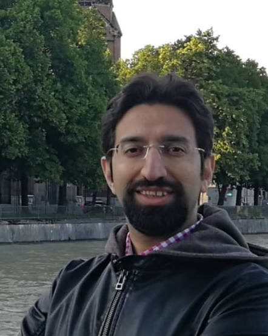 |  [Mohammad-Ali Nikouei Mahani](https://www.linkedin.com/in/mohammad-ali-nikouei-mahani-24109528/). Senior Machine Learning Engineer at BMW | Hardware engineer in Shiraz University Signal Processing Center (SPC). [Mobile ECG and Holter Monitor Design](https://rsameni.github.io/Research/Projects/HolterMonitor/NikoueiHolters.png) | 2009-2010
 |  [Hamed Hassani-Saadi](https://www.linkedin.com/in/hamed-hassani-saadi-060292100/). Machine learning engineer at Rianta Solutions | Hardware engineer in Shiraz University Signal Processing Center (SPC). MS thesis in AI: [Application of signal processing algorithms for non-numeric data](https://doi.org/10.1186/s12859-017-1524-0) (The notion of interpretive signal processing) | 2010-2013
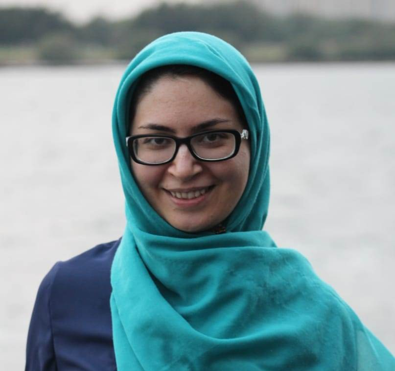 |  [Marzieh Fatemi](https://www.linkedin.com/in/marzieh-fatemi-04ba846b/). Biomedical software developer at ScienceBeam | MS thesis in BME: [Application of subspace tracking techniques for fetal cardiac signal extraction](https://doi.org/10.1007/s40998-017-0018-4) | 2011-2013
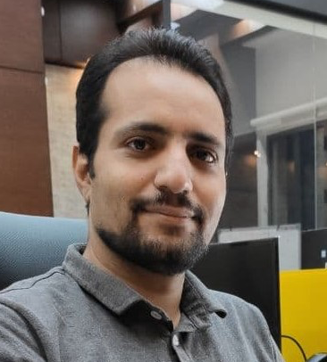 |  [Sajjad Karimi](https://www.linkedin.com/in/sajjad-karimi-67483b99/). PhD candidate in Biomedical Engineering at Sharif University of Technology | Blind Source Separation Algorithm Developement  | 2011-2013
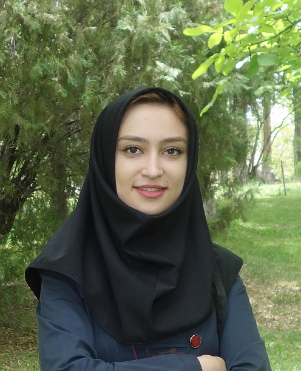 |  [Maryam Samieinasab](https://scholar.google.com/citations?user=B2Luc-QAAAAJ&hl=en). PhD From Isfahan University of Medical Sciences, Postdoctoral fellow, Baylor College of Medicine (BCM), Houston, Texas (Starting Aug 2020) | MS thesis in BME: [Modeling and Denoising of Fetal Phonocardiogram](https://doi.org/10.1109/IranianCEE.2015.7146186)| 2012-2015
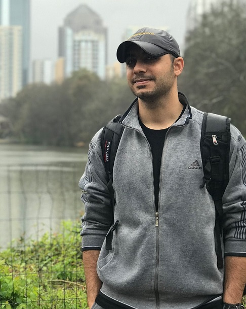 |  [Esmaeil Seraj](https://www.linkedin.com/in/esmaeil-seraj-70590b80/). PhD student at Georgia Institute of Technology | MS thesis in BME: [Study and comparison of cerebral signal phase extraction and analysis methods](https://github.com/EsiSeraj/EEG-PhaseFreq-Analysis) | 2013-2016
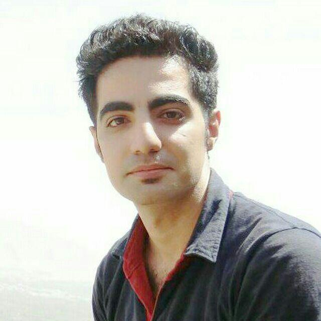 |  [Roohollah Mohammadzadeh](mailto:ro.mohammadzadeh@gmail.com). PhD Student at Polytechnique Montréal (starting Aug 2020) | MS thesis in Computer Architecture: Implementation of blind source separation and frequency scrambling algorithms on FPGA soft-cores using mixed design | 2013-2016
 |  [Peiman Gordany](https://www.linkedin.com/in/peiman-gordany-8b0385b5). MS Graduate in Telecommunications, Senior Design Engineeer at [VAP, Inc.](http://vapco.ir/) | Digital and analog electronics and telecommunications systems expert, Medical electronics device designer and developer | 2014-2020
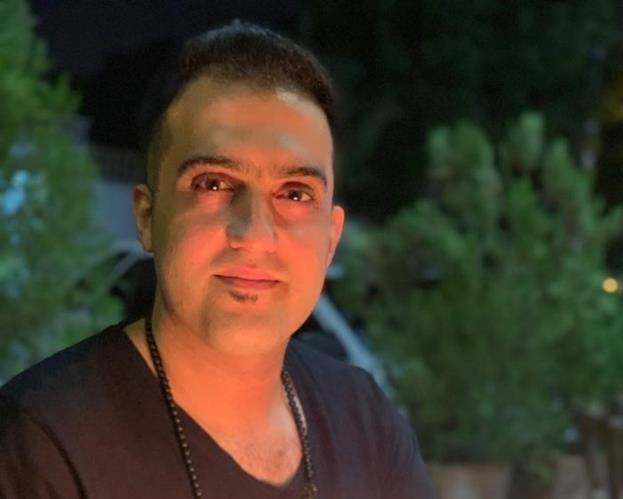 |  [Saman Doostkam](mailto:samandoostkam26@yahoo.com). PhD Candidate in Biomedical Engineering at Shiraz University | MS thesis in BME: Design and implementation of a portable assistive system for visually impaired people | 2014-2016
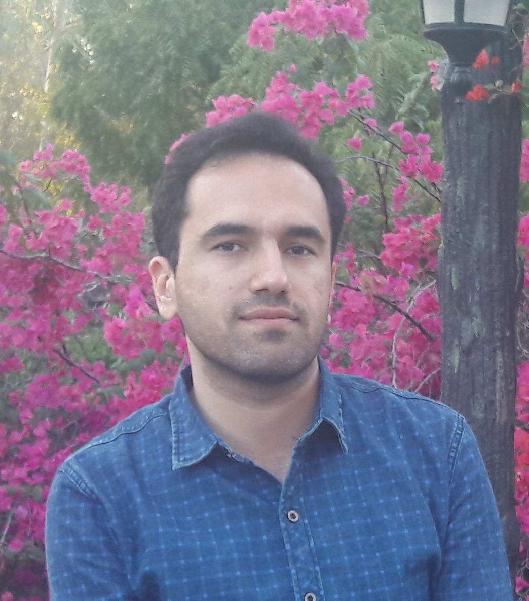 |  [Mahdi Rahbar-Alam](mailto:m.rahbaralam@gmail.com). Electronics Designer at Rayan Energy Co., Biomedical Engineer at Shiraz University of Medical Sciences | MS thesis in BME: [Evaluation of Instantaneous Frequency Estimation Techniques with Application to Electroencephalogram Analysis](https://www.biorxiv.org/content/10.1101/2020.05.13.092841v1) | 2014-2017
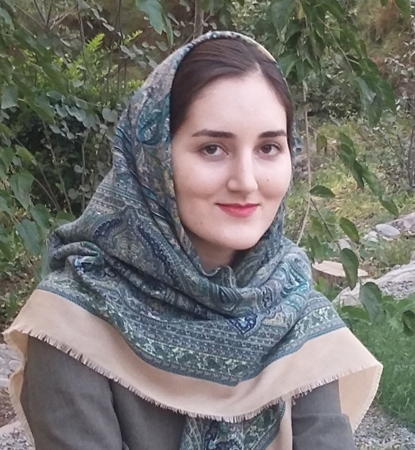 |  [Laleh Akbari](https://www.linkedin.com/in/laleh-akbari/). FPGA Developer at [Faraz Ertebat](http://farazcomm.com) | MS thesis in Computer Atchitecture: Random Circuit Generation for Evaluation of Different Levels of Synthesis and Implementation of Reconfigurable Circuits | 2014-2017
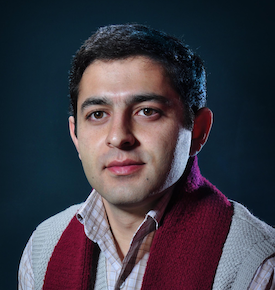 |  [Pezhman Torabi](mailto:torabi.pezhman@gmail.com). Documentary filmmaker and entrepreneur | MS thesis in Computer Architecture: Implementation of Artificial Neural Networks on FPGA with Scalable and Parametric Design | 2014-2017
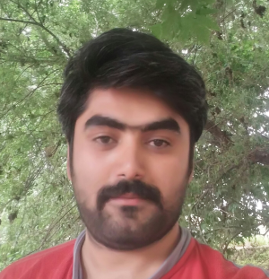 |  [Arsalam Kazemnejad](mailto:arsalan.kazemnejad@gmail.com). MS Graduate | MS thesis in BME: Analysis of Synchronous Electrocardiogram and Phonocardiogram Parameters Extracted from Normal Subjects | 2015-2018
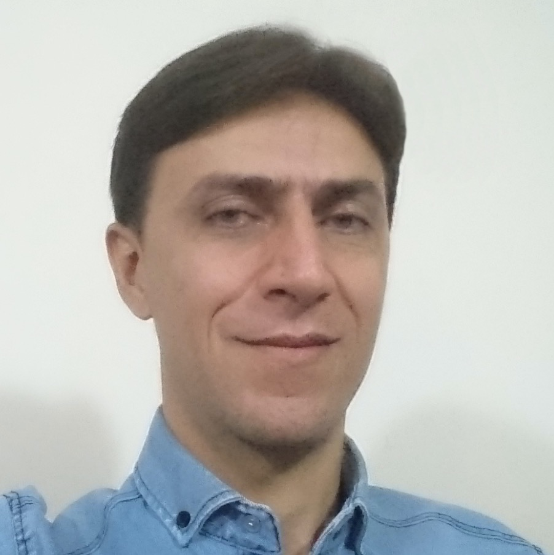 |  [Saeed Keshavarzi](mailto:keshavarzisaeid14@gmail.com). IT Expert at Fars Regional Electric Company | MS thesis in Compouter Architecture: Designing a Hardware Architecture for the Implementation of Online Subspace Tracking Algorithms | 2015-2018
 |  [Farzin Negahbani](http://www.negahbani.info). Master of Computer Science, [KUIS AI Lab](https://github.com/Farzin-Negahbani), Koç University | FPGA Lab Board Design and Implementation | 2016-2018
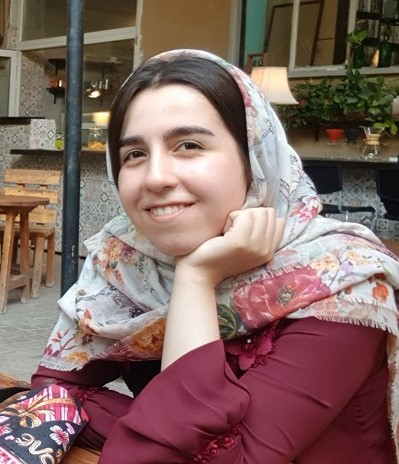 |  [Najmeh Kheram](mailto:nkheram@gmail.com). Master 2 Student (the [SIGMA Program](https://phelma.grenoble-inp.fr/en/studies/master-signal-image-processing-methods-and-applications#page-presentation)), Grenoble Alpes University | MS thesis in BME: Modeling and Denoising of Phonocardiogram Signals| 2016-2019
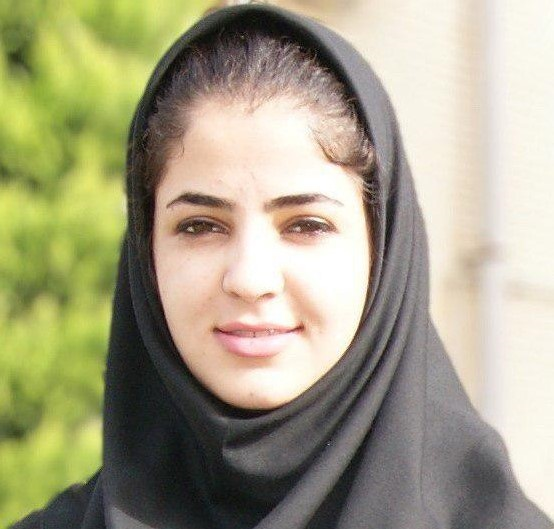 | [Maryam Maghsoudi](mailto:maghsoudimaryam27@gmail.com). MS Graduate | MS thesis in BME: Tracking and estimation of biological branching structures| 2016-2019
To be added |  To be added | To be added | To be added
 ... |  ... | ... | ...
 
